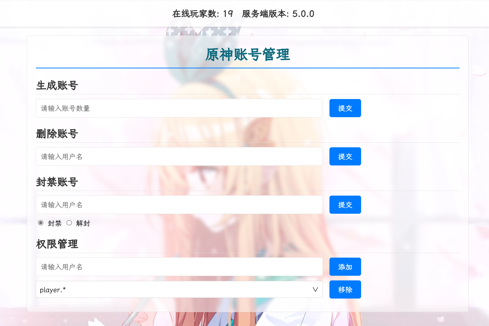
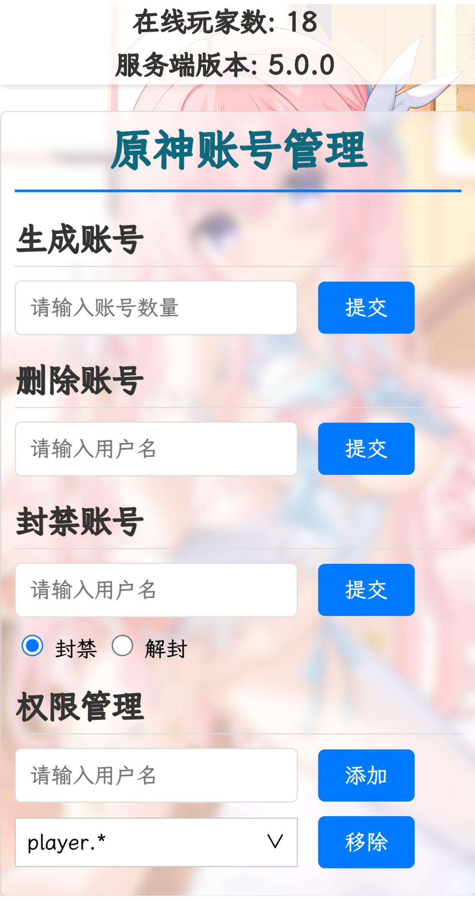

# Grasscutter-AccountManager
管理某动漫游戏的账号，包括批量生成账号、删除账号、封禁账号和账号授权等功能。

## 功能
- 在线人数统计
- 批量生成账号
- 删除账号
- 封禁账号
- 用户授权

  
## 效果预览

### PC端
  


### 移动端


## 运行环境
- **操作系统**：Windows 10/Linux（推荐 Ubuntu 20.04 以上；其他发行版未测试）
- **Python**：版本 3.x 或更高

## 配置文件
配置文件位于 `config.py`。
- 如果你的 MongoDB 实例启用了安全认证，请将 `AUTHORIZATION` 设置为 `True`，并填好数据库用户、密码、验证数据库。

## 构建

### Windows
1. **环境配置**
   - 从 [python.org](https://www.python.org/downloads/windows/) 安装 Python。

2. **构建**
   - 打开 PowerShell 并运行：
     ```powershell
     .\build.bat
     ```

3. **启动服务器**
   - 运行：
     ```bash
     python main.py
     ```

### Linux
## 方法一（推荐）
1. **创建虚拟环境并启动**
   - 运行：
     ```bash
     chmod +x venv.sh
     ./venv.sh
     ```

## 方法二

1. **构建**
   - 运行：
     ```bash
     ./build.sh
     ```

2. **启动服务器**
   - 运行：
     ```bash
     gunicorn -w 4 -b 0.0.0.0:33489 main:app -D --access-logfile log/gcweb.log --error-logfile log/gcweb.error.log
     ```


## 访问
- **URL**：[http://127.0.0.1:33489](http://127.0.0.1:33489)  
**注：端口号可在 main.py 文件里修改，外网访问需要放通TCP端口33489（默认端口）**
 
 

## 许可
该项目使用 MIT 许可协议。有关详细信息，请参见 [LICENSE](LICENSE) 文件。
